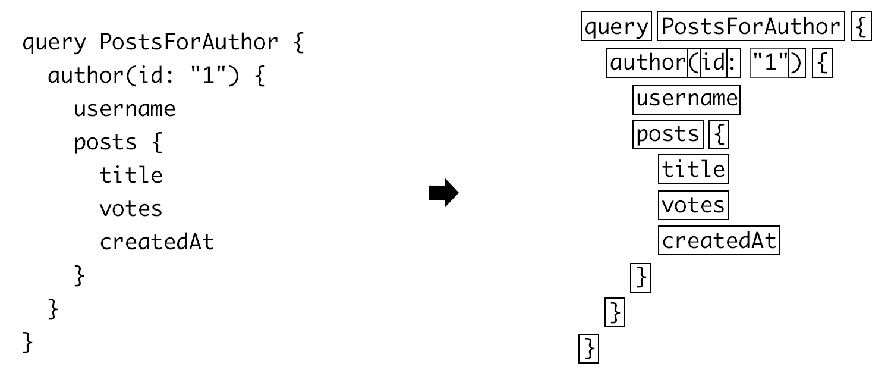
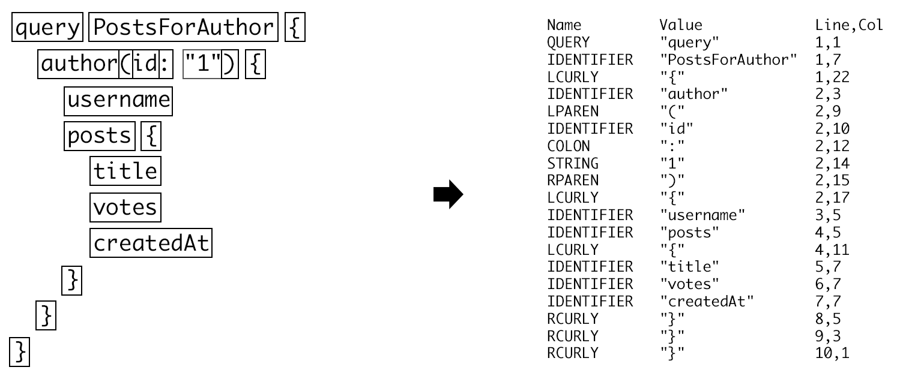
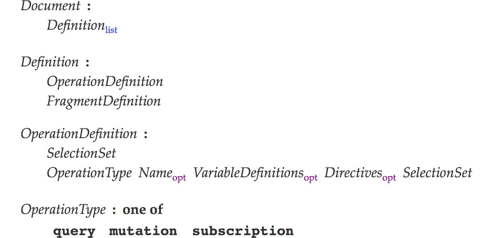
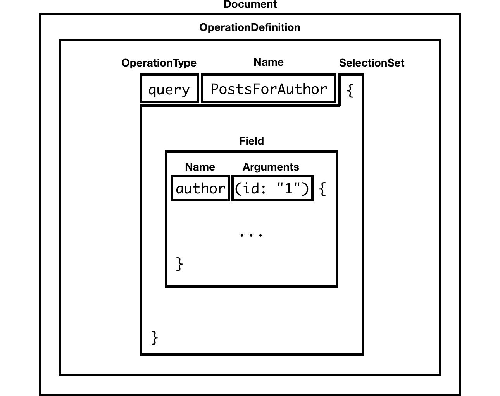
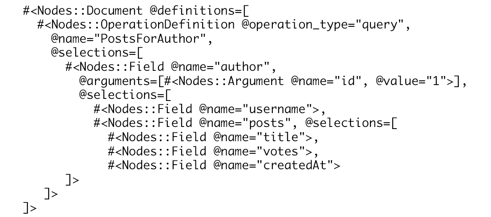

# Life of a GraphQL Query - Lexing/Parsing

Last week [I wrote about how][medium_article] I used Ruby's `TracePoint` and Graphviz to generate graphs
to familiarize myself with new codebases. I originally used this approach to learn the internals of the
[GraphQL Ruby gem][graphql-ruby-gem].

I figured a good follow-up would be to share what I learned about the internals of this package. Even
if you don't know Ruby, these notes are still valuable to anyone wanting to learn about the
internals of executing a GraphQL query.

When you execute a GraphQL query (say via an HTTPS request) one of the very first things the server needs
to do is transform the query (currently a string) into something it understands. This is also known
as lexing and parsing.

Lexing (or lexical analysis) is the process of breaking up a stream of characters (in our case a GraphQL query) into
tokens.

The rules the GraphQL lexer uses to split up the query are defined
[in the GraphQL grammar][graphql_grammar].



While some implementations of GraphQL have hand-written lexers (i.e. [graphql-js' lexer][graphql-js-lexer]),
GraphQL Ruby uses a tool called [Ragel][ragel] to generate its lexer.

At the core of the [`lexer.rl`][graphql-ruby-lexer-rl] Ragel file is a set of regular expressions:

```
%%{
  machine graphql_lexer;

  INT =           '-'? ('0'|[1-9][0-9]*);
  IDENTIFIER =    [_A-Za-z][_0-9A-Za-z]*;
  ON =            'on';
  FRAGMENT =      'fragment';
  TRUE =          'true';
  FALSE =         'false';
```

The regular expressions are then used in the `main` scanner:

```
  main := |*
    INT           => { emit(:INT, ts, te, meta) };
    IDENTIFIER    => { emit(:IDENTIFIER, ts, te, meta) };
    ON            => { emit(:ON, ts, te, meta) };
    FRAGMENT      => { emit(:FRAGMENT, ts, te, meta) };
    TRUE          => { emit(:TRUE, ts, te, meta) };
    FALSE         => { emit(:FALSE, ts, te, meta) };
```

As the lexer analyzes the query string, whenever it finds a token that matches a regular expression
on the left, the action on the right is executed.

The [`emit` method][emit-code] populates an array of tokens. Each token keeps track of a few things:

- The `name` (what type of token was captured). i.e. `:IDENTIFIER`
- The `value` (what the regular expression matched). i.e. `author`
- The line and column the token was found on. i.e. line `2` column `3`



You might notice that none of the whitespace from the original query shows up in the token list. This is because
spaces and tabs are part of [the ignored tokens][ignored-tokens] in the GraphQL grammar.

Now that the query string is split up into tokens, the next step is to turn sequences of tokens into a more abstract
representation of the language. This is the job of the parser.

Like the lexer, the rules the parser follows are defined in [the GraphQL grammar][graphql-grammar-parser].

I've found it incredibly valuable to glance over the GraphQL grammar. Not only did it help me better understand
the language, but it helped me know the name of each part of the query which I've found to be essential for
good team communication.



The grammar reads from top to bottom and is essentially a set of rules.

Here's what the excerpt above is saying:

- The root of all GraphQL queries is known as a `Document`.
- A `Document` is one or many `Definition`.
- A `Definition` is either a `OperationDefinition` or `FragmentDefinition`.
- An `OperationDefinition` is either a `SelectionSet` or `OperationType` optionally followed by a `Name`
  optionally followed by `VariableDefinitions` and so forth.

A lot of the rules depend on other rules, but as you continue reading, the names of tokens start appearing. For
example the rule for `OperationType` states that it can only be one of the following tokens: `query`, `mutation`
or `subscription`.

Here's a visual representation of the example query above once it is parsed out:



Just like the lexer, some implementations of GraphQL have hand-written parsers (i.e.
[graphql-js' parser][graphql-js-parser]), but GraphQL Ruby uses a tool called [Racc][racc] to generate its parser.

The rules in the [`parser.y`][graphql-ruby-parser] Racc file look a lot like the grammar in the GraphQL spec
with the exception that there is an action (Ruby code) attached to each rule. We'll come back to that shortly.

Here's a simplified version of what the rules look like to parse arguments (i.e. `(first: 10, sortBy: "something")`).

```
arguments:
    LPAREN RPAREN
  | LPAREN arguments_list RPAREN
```

GraphQL Ruby uses the convention of capitalizing tokens in the parser rules, this is why `LPAREN` and `RPAREN` are
uppercase above. They are the token names for the characters `(` and `)`.

The above rule states `arguments` are either `()` or a list of arguments (i.e. `arguments_list`) between parentheses.

```
arguments_list:
    argument
  | arguments_list argument
```

An `arguments_list` is either a single `argument` or multiple `arguments`. You might notice recursion happening in the
rule above in order to express multiples of one thing.

```
argument:
    name COLON input_value
```

An `argument` is a `name` followed by a colon and an `input_value`.

```
name:
    IDENTIFIER
```

A `name` is an identifier. Remember `IDENTIFIER` is a token the lexer emits when it finds something that matches this
regular expression: `[_A-Za-z][_0-9A-Za-z]*;`.

```
input_value:
    INT
  | STRING
  | TRUE
  | FALSE
```

An `input_value` is either an integer, a string or a boolean.

Here's the same example now with actions attached to the rules:

```
arguments:
    LPAREN RPAREN                { return [] }
  | LPAREN arguments_list RPAREN { return val[1] }

arguments_list:
    argument                { return [val[0]] }
  | arguments_list argument { val[0] << val[1] }

argument:
    name COLON input_value { return Nodes::Argument.new(name: val[0], value: val[2]) }

input_value:
    INT         { return val[0].to_i }
  | STRING      { return val[0].to_s }
  | TRUE        { return true }
  | FALSE       { return false }
```

Actions can return values. The variable `val` used within the actions contains these said values for
the rules that were matched.

If we were to parse our previous example `(first: 10, sortBy: "something")` with the rules above,
we would obtain the following:

```
[
  #<Nodes::Argument @name="first", @value="10">,
  #<Nodes::Argument @name="sortBy", @value="something">,
]
```

Although this is a simplified version, the actual grammar rules used by GraphQL Ruby's parser are similar.

The data structure above is known as an abstract syntax tree (AST).

Now you might be wondering what does the AST look like for our example query.

Here's the original query:

```graphql
query PostsForAuthor {
  author(id: "1") {
    username
    posts {
      title
      votes
      createdAt
    }
  }
}
```

Here's the AST representation the parser would return for that query:



Pretty cool, uh?

In case you were wondering, the `lexel.rl` Ragel file and `parser.y` Racc file are both used in order to generate
regular Ruby files `lexer.rb` and `parser.rb` by [the `build_parser` Rake task][build-parser-rake].

The next step in the life of a GraphQL query is validation, but I'll keep that for another post.

If you want to learn more about lexers, parsers, and abstract syntax trees (AST), I recommend getting a copy
of Thorsten Ball's incredible book: [Writing an interpreter in Go][interpreter-go].

[graphql-ruby-gem]: https://github.com/rmosolgo/graphql-ruby
[medium_article]: https://medium.com/@cjoudrey/familiarizing-myself-with-a-new-codebase-using-rubys-tracepoint-and-graphviz-aebd5d6ac2cd
[graphql_grammar]: http://facebook.github.io/graphql/#sec-Appendix-Grammar-Summary.Lexical-Tokens
[graphql-js-lexer]: https://github.com/graphql/graphql-js/blob/6938c1ab65264616805889c6e19fb3b74ce95658/src/language/lexer.js
[graphql-js-parser]: https://github.com/graphql/graphql-js/blob/6938c1ab65264616805889c6e19fb3b74ce95658/src/language/parser.js
[graphql-ruby-parser]: https://github.com/rmosolgo/graphql-ruby/blob/3f29777d60411d1b78247c31760c5728c35e3328/lib/graphql/language/parser.y
[ragel]: http://www.colm.net/open-source/ragel/
[graphql-ruby-lexer-rl]: https://github.com/rmosolgo/graphql-ruby/blob/3f29777d60411d1b78247c31760c5728c35e3328/lib/graphql/language/lexer.rl
[emit-code]: https://github.com/rmosolgo/graphql-ruby/blob/3f29777d60411d1b78247c31760c5728c35e3328/lib/graphql/language/lexer.rl#L158
[ignored-tokens]: https://facebook.github.io/graphql/#sec-Appendix-Grammar-Summary.Ignored-Tokens
[graphql-grammar-parser]: https://facebook.github.io/graphql/#sec-Appendix-Grammar-Summary.Query-Document
[racc]: https://github.com/tenderlove/racc
[interpreter-go]: https://interpreterbook.com
[build-parser-rake]: https://github.com/rmosolgo/graphql-ruby/blob/3f29777d60411d1b78247c31760c5728c35e3328/Rakefile#L20
