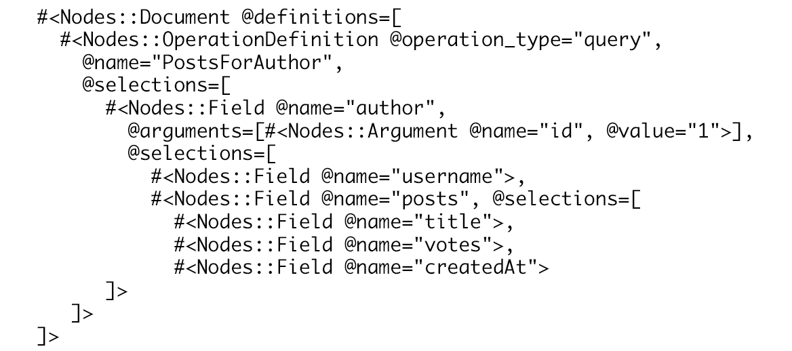
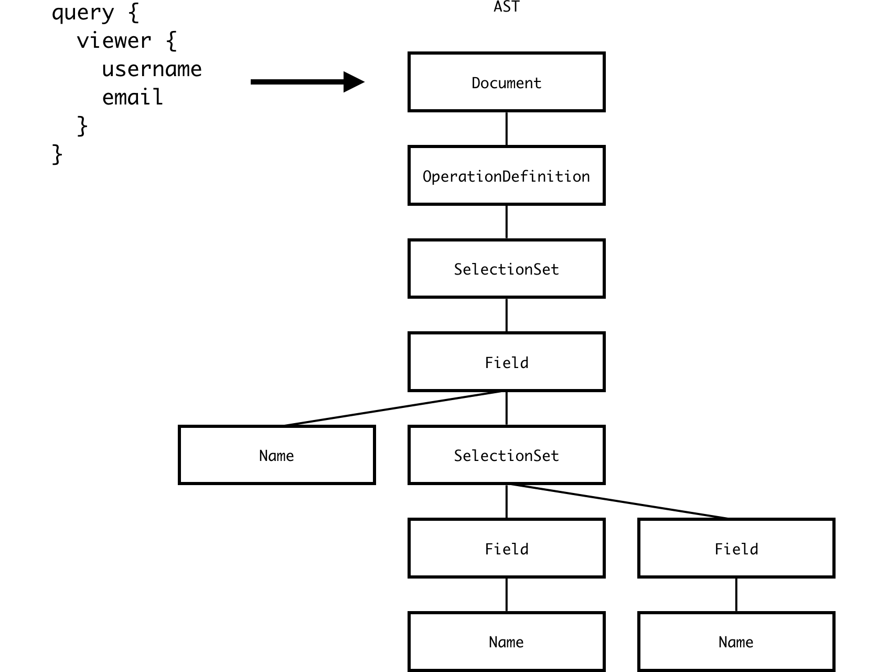
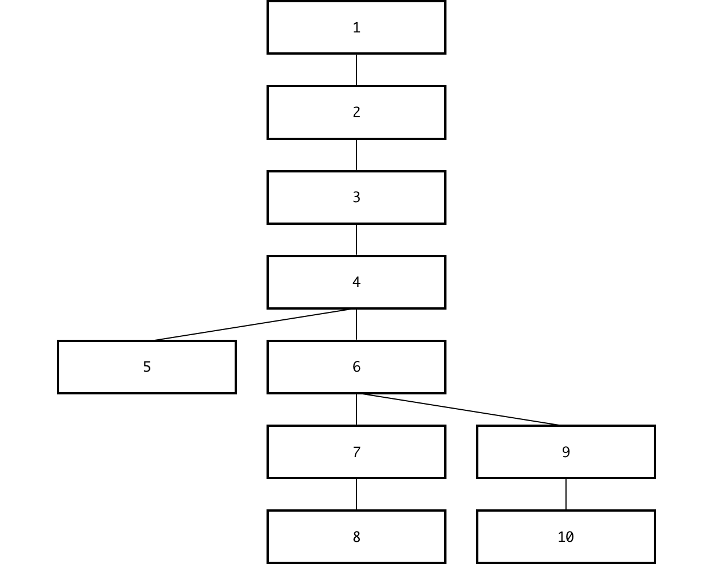

# Life of a GraphQL Query - Validation

A few weeks ago I wrote about the first phase of what happens when a GraphQL query is
executed: [lexing and parsing][article-part-1].

We left off with an AST representation of a query which we obtained from the parser.



At this point we know the query is syntactically correct, but that doesn't necessarily mean we can execute it.

```graphql
query PostsForAuthor {
  author(id: "1") {
    username
    posts {
      title
      votes
      createdAt
    }
  }
}
```

Many things could be wrong with the query. The `Author` type could very well not have a `username` field,
the argument `id` could be of type `Int`, etc.. The parser doesn't care about this. Instead, that is the job of the
validation phase.

The GraphQL specification has an [entire section that covers validation][spec-validation]. Each validation rule
is explained in detail accompanied by a pseudo implementation and examples of queries that pass/fail the rule.
It's a great resource that I've used countless amount of times when I wasn't sure about a validation or when I
wanted to confirm a behaviour in the GraphQL implementation that I was using.

After digging into various GraphQL implementations like [GraphQL Ruby][ruby], [Sangria][scala], and [GraphQL.js][js]
I noticed they all have one thing in common when it comes to validation: [the visitor pattern][visitor-pattern].

While Wikipedia provides a [theoretical explanation of the visitor pattern][visitor-pattern], I'd like to explore
how it's used in GraphQL implementations to power the validation phase. We'll also look at some sample code
from [GraphQL.js][js].

First, let's start with a simple query and its AST representation:



In order to determine whether the query can be executed or not, GraphQL.js' [`validate`][validate] function will
traverse the AST using a depth-first traversal. In other words, it will start at the root of the AST (in this
case, the `Document` node) and it will explore as far as possible along the first branch before backtracking and continuing on
to the next branch.



Visitors (in this case, validations rules) can watch as the AST is being traversed and perform actions when a certain
kind of node is reached. In [GraphQL.js][js], visitors can be implemented in different ways, but in their simplest form
they are an object with a `enter` and `leave` function.

During the traversal, when a node is reached the `enter` function of the visitor will get called. When backtracking,
the visitor's `leave` function gets called.

Here's a simple visitor that logs whenever a node is entered or left. Notice in this example we are using GraphQL.js'
[`visit`][visit] function to traverse the AST. This is the same function that [`validate`][validate] uses.

```js
import { visit } from "graphql/language/visitor";
import { parse } from "graphql/language";

const query = `
  query {
    viewer {
      username
      email
    }
  }
`;

var indent = "";

var visitor = {
  enter(node) {
    console.log(`${indent}Enter ${node.kind}`);
    indent = indent + "  ";
  },

  leave(node) {
    indent = indent.substring(0, indent.length - 2);
    console.log(`${indent}Leave ${node.kind}`);
  }
};

visit(parse(query), visitor);

// Output:
//
// Enter Document
//   Enter OperationDefinition
//     Enter SelectionSet
//       Enter Field
//         Enter Name
//         Leave Name
//         Enter SelectionSet
//           Enter Field
//             Enter Name
//             Leave Name
//           Leave Field
//           Enter Field
//             Enter Name
//             Leave Name
//           Leave Field
//         Leave SelectionSet
//       Leave Field
//     Leave SelectionSet
//   Leave OperationDefinition
// Leave Document
```

Some GraphQL rules might only be interested by a specific kind of node. For example, a rule might want to validate that
an `OperationDefinition` always has a name (i.e. `query Name { .. }`.) For this reason [each GraphQL.js rule][rules]
can decide to hook onto individual kinds of nodes. This can be done by nesting the `enter` and `leave` functions under
a key named the same as the kind of AST node of interest.

Here's an example of a visitor that only cares about when an `OperationDefinition` node is entered:

```js
import { visit } from "graphql/language/visitor";
import { parse } from "graphql/language";

const query = `
  query FetchViewerUsernameAndEmail {
    viewer {
      username
      email
    }
  }
`;

var visitor = {
  OperationDefinition: {
    enter(node) {
      console.log(node);
    }
  }
};

visit(parse(query), visitor);

// Output:
//
// { kind: 'OperationDefinition',
//   operation: 'query',
//   name:
//    { kind: 'Name',
//      value: 'FetchViewerUsernameAndEmail',
//      loc: { start: 9, end: 36 } },
//   variableDefinitions: [],
//   directives: [],
//   selectionSet:
//    { kind: 'SelectionSet',
//      selections: [ [Object] ],
//      loc: { start: 37, end: 88 } },
//   loc: { start: 3, end: 88 } }
```

The `OperationDefinition` key in the above example can be replaced with [any valid AST node kind][ast-nodes] to observe
that kind of node. A visitor can also observe multiple kinds of nodes at once by setting the corresponding keys.

Now that we have a better understanding of the visitor pattern and how visitors are implemented in GraphQL.js, we can
add the missing parts to turn this visitor into a GraphQL.js validation rule.

```js
import { GraphQLError } from "graphql/error";

function OperationHasName(context) {
  return {
    OperationDefinition: {
      enter(node) {
        if (!node.name) {
          context.reportError(
            new GraphQLError(
              `The operation \`${node.operation}\` is missing a name.`,
              [node]
            )
          );
        }
      }
    }
  };
}
```

If you're interested in learning more about the validation phase, check out GraphQL.js' [src/validation][src-validation]
folder. A lot of what was discussed is explained as comments in the code.

While writing this article I started a project called [GraphQL Schema Linter][graphql-schema-linter] which is built
on top of GraphQL.js' `validate` and `visit` functions. I'm always looking for help so whether you are new to this or not
come join the discussions in the repository.

[article-part-1]: https://medium.com/@cjoudrey/life-of-a-graphql-query-lexing-parsing-ca7c5045fad8
[ruby]: https://github.com/rmosolgo/graphql-ruby
[scala]: https://github.com/sangria-graphql/sangria
[js]: https://github.com/graphql/graphql-js
[visitor-pattern]: https://en.wikipedia.org/wiki/Visitor_pattern
[validate]: https://github.com/graphql/graphql-js/blob/6953f9714b785bbcd89f0103fd73401c06d5f6fe/src/validation/validate.js#L36
[visit]: https://github.com/graphql/graphql-js/blob/6953f9714b785bbcd89f0103fd73401c06d5f6fe/src/language/visitor.js#L62
[rules]: https://github.com/graphql/graphql-js/tree/6953f9714b785bbcd89f0103fd73401c06d5f6fe/src/validation/rules
[spec-validation]: https://facebook.github.io/graphql/#sec-Validation
[ast-nodes]: https://github.com/graphql/graphql-js/blob/6953f9714b785bbcd89f0103fd73401c06d5f6fe/src/language/ast.js#L117
[graphql-schema-linter]: https://github.com/cjoudrey/graphql-schema-linter
[src-validation]: https://github.com/graphql/graphql-js/tree/6953f9714b785bbcd89f0103fd73401c06d5f6fe/src/validation
